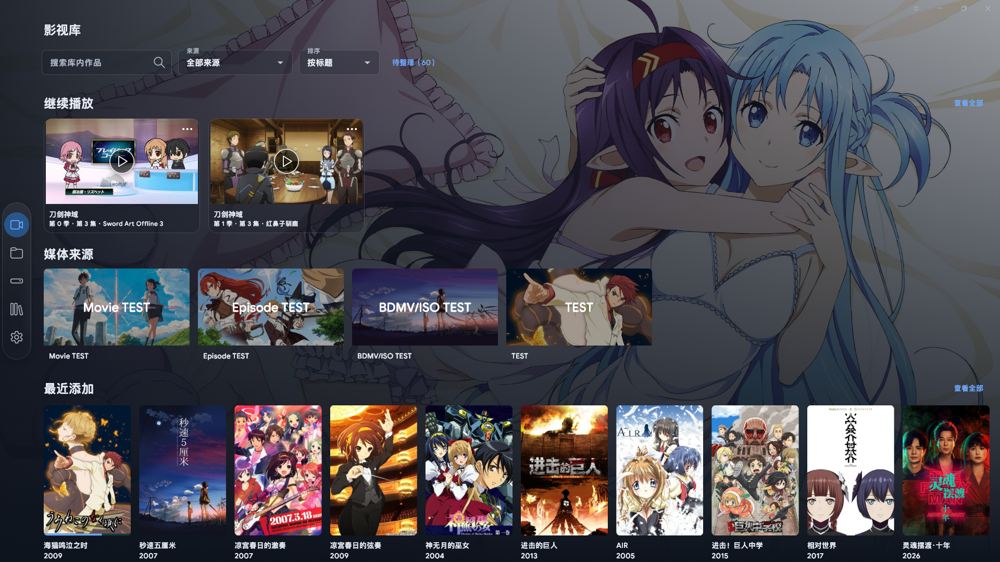

<h1 align="center">StreamPath</h1>

在一个 Windows 桌面应用中浏览网络存储、本地媒体和媒体服务器，并通过 MPV 播放。

Windows 10/11 x64 · WebDAV / SMB / FTP / NFS · Jellyfin / Emby · 影视库

<a href="#快速开始">快速开始</a> · <a href="#影视库入门">影视库入门</a> · <a href="docs/PROJECT.md">技术与兼容说明</a>

影视库主页

<table>
  <tr>
    <td width="50%"></td>
    <td width="50%"></td>
  </tr>
  <tr>
    <td align="center">作品详情、演职人员与关联资源</td>
    <td align="center">剧集浏览、简介与观看进度</td>
  </tr>
</table>

## StreamPath 能做什么

| 功能       | 说明                                                               |
| -------- | ---------------------------------------------------------------- |
| 🎬 影视库   | 整理电影与剧集，浏览合集、每日精选、库内演职人员、详情、分集和继续播放；支持 TMDB 与本地 NFO。 |
| 🌐 多来源浏览 | 挂载 WebDAV、SMB、FTP/FTPS、NFS 或本地文件夹；连接 Jellyfin、Emby 媒体库。 |
| ▶️ 视频与音乐 | 将视频、音频和 STRM 交给外部播放器（MPV）；支持续播、自动切集、外挂字幕与字体、LRC 歌词和封面。           |
| 💿 蓝光    | 本地 ISO/BDMV 可选蓝光菜单或主标题；WebDAV ISO/BDMV 支持 Title 播放，HDMV 菜单为测试功能。 |
| 🕘 收藏与历史 | 按来源查看收藏、继续播放和最近播放记录；可选择类别导入、导出资料与个人状态。 |

界面支持简体中文、繁体中文、日文和英文。OpenList/AList 可通过 WebDAV 使用，搜索和恢复等增强功能会根据服务端能力启用。

## 快速开始

1. 从项目的 [Releases](../../releases) 页面获取 Windows x64 安装包（`.setup.exe`），按向导安装；也可解压便携包（`.portable.zip`）并运行 `streampath.exe`。
2. 在「设置 → 播放」选择播放器可执行文件，推荐使用 MPV。
3. 添加媒体来源：
   - **WebDAV：** 在「设置 → 服务器」创建服务器档案，再到「文件夹 → 网络存储 → 添加网络存储」选择「添加 WebDAV 挂载」。准备服务器地址、用户名和密码；服务器允许空密码时可留空。
   - **本地文件夹：** 在「文件夹 → 本地文件夹」添加本地目录。
   - **SMB、FTP/FTPS、NFS：** 在「文件夹 → 网络存储」新增连接，填写协议地址和账号。SMB 可填写域，NFS 可填写版本及 UID/GID，FTP 默认使用被动模式。
   - **Jellyfin、Emby：** 在「文件夹 → 媒体服务器」新增服务器地址和账号。在影视库顶部下拉框选择服务器后读取服务器已有资料与合集，播放使用服务器允许直接播放的版本。
4. 打开「文件夹」，进入媒体目录并点击视频、音频或 STRM 文件播放。

播放器格式支持由所配置的播放器决定。播放 OpenList 上的 STRM 文件时，建议在对应存储设置中启用「启用签名」。

## 安装与软件更新

安装版默认安装到 `%LOCALAPPDATA%\Programs\StreamPath`，仅供当前 Windows 用户使用，无需管理员权限。可选择其他安装目录，并创建桌面快捷方式；卸载可通过 Windows「已安装的应用」完成，配置、缓存和播放记录保留在用户数据目录。

在「设置 → 常规 → 软件更新」查看版本或手动检查。软件启动后自动检查此项目的正式 Release，并在后台下载匹配的安装版或便携版更新。下载完成后点击「重启更新」；先结束播放、扫描和导入，软件保存状态后退出并更新，随后重新启动。

更新保留当前副本的配置、缓存和播放记录。安装版和便携版分别使用自己的数据目录；安装新副本不会自动搬移其他便携副本的资料。历史版本需要先手动安装包含更新功能的版本；Release 缺少发布清单或匹配文件时，软件提示无法自动更新。

## 影视库入门

1. 先按上面的步骤添加媒体来源。影视库顶部下拉框默认选择「主影视库」，汇总已启用的影视目录；选择 Jellyfin、Emby 名称可浏览该服务器的作品。
2. 打开「文件夹 → 影视库」，添加电影或剧集所在目录。
3. 点击「手动扫描」，扫描完成后即可在影视库主页浏览作品。
4. 如需匹配 TMDB 作品资料，在影视库设置中保存并验证 TMDB **Read Access Token**；不配置 Token 也可以建立清单并播放媒体。

扫描根据文件名和目录识别资源，不读取媒体内容或探测时长、轨道等技术信息。文件名带有季集编号时，可帮助剧集正确归类。

在「设置 → 影视库 → 影视库偏好」填写「屏蔽文件夹名称」，使用英文逗号分隔多个名称，并点击「保存文件夹屏蔽」。模糊模式匹配包含连续关键字的目录，精确模式要求完整名称相同，两种模式都区分大小写。命中目录及其子目录跳过扫描；下次扫描或刮削元数据时，对应的已入库资源和待整理条目也会移除。清空名称并保存可取消屏蔽，再次扫描可重新收录。

目录卡片右上角的开关控制是否启用该影视库。关闭后，相关作品、来源入口及合集成员从影视库展示中隐藏，来源下拉框不能选择该目录；全部成员都被隐藏的合集也会隐藏。停用目录也不参与影视库播放源选择与后续切集。记录和个人状态保留，重新开启即可恢复。关闭的目录不参与定时扫描；目录设置中可选择「指定扫描」处理一个子目录，自动扫描默认每天执行一次，间隔最短六小时，仅在软件运行且没有播放或扫描任务时执行。

「本地元数据模式」优先使用已有 NFO 和海报，停止自动网络匹配，仍可手动刮削。网络模式在没有可用网络资料时尝试本地资料。「允许写回缺少的 NFO 和图片」默认关闭，需要在来源设置中单独开启；FTP/FTPS 不支持安全创建文件，自动写回开关禁用。只读来源与媒体服务器不写回，已有文件保留。

右键作品封面选择「加入合集」，可以选已有合集或创建新合集；管理页可修改名称、封面与成员，删除合集保留媒体。TMDB 电影系列在库内至少有两部可用作品时展示；服务器自定义合集随服务器刷新读取，同一服务器账号的重复挂载在主影视库只展示一份合集；移除服务器同时移除其合集。合集栏右侧「查看全部」打开完整合集网格，子页面与所有服务器共享影视库自定义背景。演职人员头像打开当前库内作品列表。「每日精选」每天固定最多十部，切页、切语言和重启保持当天顺序。

右键作品、季或资源封面，可选择「以本作品／本季／本集／本资源创建播放列表」，也可「加入播放列表…」。作品跨多个来源时先选来源；一个列表固定同一来源，可以混合电影和不同剧集。作品／季批量加入只采用已有季集映射，同集多版本自动选择，优先沿用上一集的目录来源，连接或打开失败时尝试其他版本；资源单项加入固定该版本。切集失败后关闭播放器，继续播放仍指向未打开的下一集。作品／季范围跟随新增集数，追加到列表末尾，手动排序和移除保持有效。

影视库工具栏的「播放列表」打开竖向管理页。每行显示小横向封面、名称、年份和季集；单击选择，双击或点击播放按钮从该行起播，按住右侧手柄拖动排序，松开即保存。更多菜单可以移除成员，列表菜单可以重命名、删除；缺失资源或停用来源仍保留不可用条目。

右键播放列表外部封面或内部条目封面，可刷新元数据、标记已看完／未看完和加入其他播放列表。外部封面的「以本列表创建播放列表」保留当前成员、顺序及版本设定，内部封面的「以本集创建播放列表」仅复制该条目；副本不继承自动追加范围。加入已有列表时按原顺序追加尚未存在的成员。无首播日期的集数按季集号排序，S00 排在所有正片季之后；有日期的集数仍按首播日期排序，已有手动顺序保持有效。

自定义列表需要 MPV，支持库内普通视频、既有 STRM 和服务器直播放视频。每次从列表启动使用最新顺序；原会话的「继续播放」恢复起播时的快照，列表编辑或删除不改变该快照。Jellyfin／Emby 视频列表随服务器刷新作为只读镜像导入，保留远端顺序和重复成员；「复制为自定义播放列表」生成可编辑副本，编辑不写回服务器。详细规则见[自定义播放列表说明](docs/影视库自定义播放列表.md)。

详情入口显示「开始播放」或已有续播；剧集优先从 S01E01 开始。继续播放及最近播放菜单可刷新播放器状态或标记本集已看完，有下一集时保留原记录位置并推进。单集有有效探测结果时显示实际影片时长，否则使用官方时长。

在影视库设置中可启用「防剧透」遮罩；未看完的封面和简介可用「展示剧透」临时揭示，标记未观看后恢复遮罩。

通过影视库设置中的导入、导出入口保存 ZIP 备份。导出文件固定保存在应用的 `stream_path_data/` 根目录，文件名为 `StreamPath-library-时间戳.zip`；点击导出即可保存。导出自定义合集结构默认不勾选；导入先检查内容与来源映射，再勾选需要的类别，冲突保留本机资料，重复导入不会增加重复记录。仅导入封面偏好不会创建缺失合集；活动播放期间不能导入播放状态。备份不包含密码、运行中播放器和临时播放地址；此 ZIP 功能不包含自定义播放列表结构。

## 支持范围与数据

- **系统：** Windows 10/11 x64。
- **播放器：** MPV 是主要支持目标；视频和音频也可按播放器参数模板使用其他外部播放器。
- **蓝光：** 支持未加密 Blu-ray。WebDAV 播放需要服务器支持随机 Range 读取和资源版本校验；DVD、AACS/BD+ 加密碟片及 BD-J 不在支持范围内。HDMV 菜单为可选测试功能。
- **便携数据：** 配置、缓存和播放记录默认保存在程序同级的 `stream_path_data/` 目录。
- **安装版数据：** 配置、缓存和播放记录保存在 `%LOCALAPPDATA%\StreamPath\stream_path_data\`，与安装目录分开。
- **媒体服务器：** 支持直接播放与进度、观看状态同步；不提供转码、直播或远程控制。正常播放合并上报约每十秒一次，暂停、跳转、切集及退出立即上报；离线状态在重连后先提交，再读取服务器状态。
- **网络协议：** 播放需要可随机读取的来源；FTP 不支持随机读取时明确失败，不整片下载。蓝光继续沿用未加密 Blu-ray、HDMV 的边界。

## 警告

请注意，本项目仅是媒体文件的管理、播放工具，不提供任何片源，开头演示内容为纯元数据

更多架构、协议和兼容细节见[技术与兼容说明](docs/PROJECT.md)。
